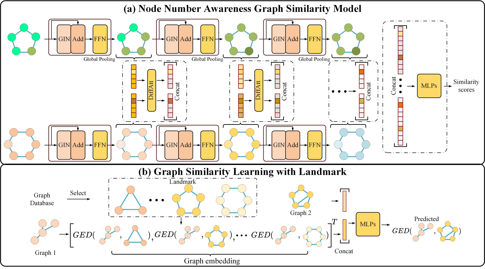

# Anonymous Code for paper "Node Number Awareness Representation for Graph Similarity Learning"




## Introduction
This repo contains the source code and dataset for our paper *Node Number Awareness Representation for Graph Similarity Learning*. The main directory contains the code files for *N2AGim* and the landmark file contains the code files for *GSL2*. We provide the trained model parameters for N2AGim in the *./result/* and *./result_norm/* files and for GSL2 in the *./landmark/results/*.

## Requirements
See "requirements.txt". Please following the https://pytorch-geometric.readthedocs.io/en/1.7.1/notes/installation.html to install the torch_geometric==1.7.1. 

<!-- ## Usage -->

## Evaluation 

The file structure of the *./result/* for N2AGim is

```
├── AIDS700nef
│   └── N2Gim
│       └── sum_none_pGinFalse_woNodeattFalse_woGraphattFalse
│           └── 2022-09-10_12-32-16
│               ├── final_0.pt
│               ├── final_optim_0.pt
│               ├── minvaild_0.pt
│               └── minvaild_optim_0.pt
├── IMDBMulti
│   └── N2Gim
│       └── sum_none_pGinFalse_woNodeattFalse_woGraphattFalse
│           └── 2022-09-10_16-48-56
│               ├── final_0.pt
│               ├── final_optim_0.pt
│               ├── minvaild_0.pt
│               └── minvaild_optim_0.pt
└── LINUX
    └── N2Gim
        └── sum_none_pGinFalse_woNodeattFalse_woGraphattFalse
            └── 2022-09-10_13-49-27
                ├── final_0.pt
                ├── final_optim_0.pt
                ├── minvaild_0.pt
                └── minvaild_optim_0.pt
```

You can evaluate our N2AGim by using the following instructions: 

```
python test.py --file_name result/AIDS700nef/N2Gim/sum_none_pGinFalse_woNodeattFalse_woGraphattFalse/2022-09-10_12-32-16/

python test.py --file_name result/LINUX/N2Gim/sum_none_pGinFalse_woNodeattFalse_woGraphattFalse/2022-09-10_13-49-27/

python test.py --file_name result/IMDBMulti/N2Gim/sum_none_pGinFalse_woNodeattFalse_woGraphattFalse/2022-09-10_16-48-56/
```

You can evaluate our GSL2 by using the following instructions: 
```
cd landmark

python mlp_test.py --dataset AIDS700nef --size 60

python mlp_test.py --dataset LINUX --size 30

python mlp_test.py --dataset IMDBMulti --size 70
```


## Run our code
To train our N2AGim : 
```
python train.py --datasets AIDS700nef --model N2Gim --graph_level_pooling sum

python train.py --datasets LINUX --model N2Gim --graph_level_pooling sum

python train.py --datasets IMDBMulti --model N2Gim --graph_level_pooling sum
```

To train our N2AGim with ATS2 similarity metric : 
```
python train_norm.py --datasets AIDS700nef --model N2Gim --graph_level_pooling sum

python train_norm.py --datasets LINUX --model N2Gim --graph_level_pooling sum

python train_norm.py --datasets IMDBMulti --model N2Gim --graph_level_pooling sum
```

To train our GSL2 after training the N2AGim with ATS2 similarity metric: 
```
cd landmark 

python mlp.py --dataset AIDS700nef --size 60

python mlp.py --dataset LINUX --size 30

python mlp.py --dataset IMDBMulti --size 70
```